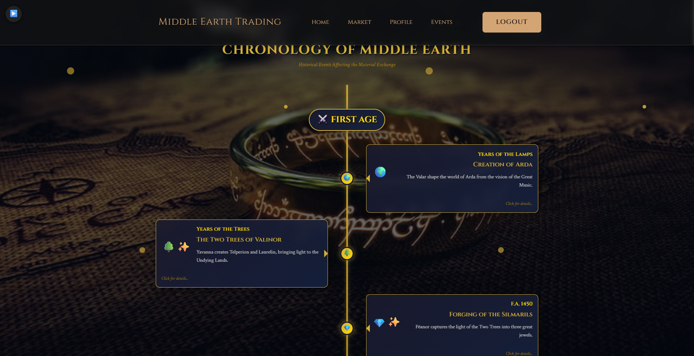
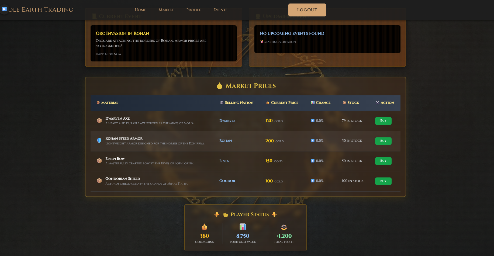
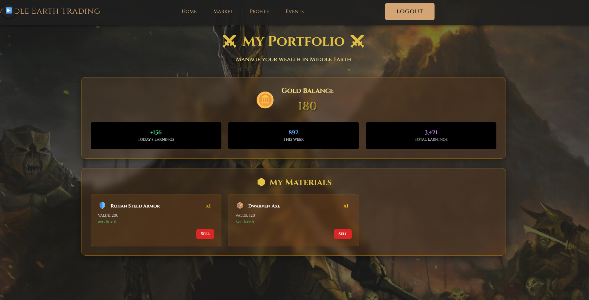

<div align="center">

  <!-- Badges -->
  <p>
    
    
    
    
    
    
    
  </p>

  <br />

  <!-- Title -->
  <h1>⚔️ Middle-Earth Trader ⚔️</h1>

  <p>
    <strong>A real-time stock market simulation set in the legendary world of J.R.R. Tolkien</strong>
  </p>

  <p>
    <em>"One Ring to rule them all, One Ring to find them, One Ring to bring them all, and in the darkness bind them."</em>
  </p>

  <br />

  <p>
    <a href="#-getting-started">Getting Started</a>
    ·
    <a href="#-features">Features</a>
    ·
    <a href="#-architecture">Architecture</a>
    ·
    <a href="#-screenshots">Screenshots</a>
  </p>

</div>

<br />

---

## 📜 About

**Middle-Earth Trader** is a full-stack web application that simulates a dynamic economy within Tolkien's Middle-Earth. Players take on the role of merchants, trading legendary materials — from **Mithril Armor** and **Silmarils** to **Lembas Bread** and **Dragon Scales** — while reacting to historical events that shift the market in real time.

An Orc invasion in Rohan? Armor prices skyrocket. The forging of the Rings of Power? Precious metals surge. Only the shrewdest trader will amass the greatest fortune.

<br />

## ✨ Features

<table>
  <tr>
    <td width="50%">

**🏗️ Decoupled Architecture**
Clean separation with a .NET 8 Web API backend and ASP.NET Core MVC frontend communicating via REST.

**📊 Dynamic Market**
Material prices fluctuate based on player trades and server-driven historical events from Middle-Earth lore.

**⚔️ Lore-Accurate Events**
13+ canonical events (Battle of Five Armies, Forging of the One Ring, etc.) each impact specific material prices.

   </td>
   <td width="50%">

**💰 Portfolio Management**
Track gold balance, portfolio value, and total profit with a premium glassmorphism-inspired UI.

**🛡️ Secure Sessions**
Encrypted cookie-based authentication with localStorage session persistence.

**🌐 100% English**
Fully localized English interface across all views, modals, alerts, and API responses.

   </td>
  </tr>
</table>

<br />

## 📸 Screenshots

<!-- 
  📌 HOW TO ADD YOUR SCREENSHOTS:
  1. Create a folder: docs/images/ in your project root
  2. Add your 3 screenshots there
  3. Replace the file names below with your actual file names
-->

<div align="center">

### 🏠 Landing Page
<!-- Replace with your screenshot -->


<br />

### 📊 Market Dashboard
<!-- Replace with your screenshot -->


<br />

### 👤 Player Profile
<!-- Replace with your screenshot -->


</div>

<br />

## 🏛️ Architecture

```
Middle-Earth-Trade/
│
├── backend/                          # .NET 8 Backend Solution
│   ├── MiddleEarthTrader.API/        # Web API Layer (Controllers, DbSeeder)
│   ├── MiddleEarthTrader.Service/    # Business Logic (Services, DTOs, AutoMapper)
│   └── MiddleEarthTrader.Repository/ # Data Access (EF Core, Migrations, DbContext)
│
└── frontend/                         # .NET 8 Frontend Solution
    └── MiddleEarthTraderFront/       # ASP.NET Core MVC (Views, JS, CSS)
        ├── Views/
        │   ├── Home/                 # Index (Landing), Trader (Market)
        │   ├── Profile/             # Player Portfolio
        │   ├── Events/              # Lore Timeline
        │   └── Shared/              # Layout, Error
        └── wwwroot/                 # Static assets (CSS, JS, images, music)
```

<br />

### Tech Stack

| Layer | Technology |
|-------|-----------|
| **API** | .NET 8 Web API, C# |
| **ORM** | Entity Framework Core (Code-First) |
| **Database** | PostgreSQL via Npgsql |
| **Mapping** | AutoMapper |
| **Docs** | Swagger / OpenAPI |
| **Frontend** | ASP.NET Core MVC, Razor Views |
| **Styling** | Vanilla CSS, Tailwind CSS, Bootstrap 5 |
| **HTTP Client** | Axios |
| **Patterns** | Repository Pattern, Dependency Injection, DTO Pattern |

<br />

---

## 🚀 Getting Started

### Prerequisites

| Tool | Version | Link |
|------|---------|------|
| .NET SDK | 8.0+ | [Download](https://dotnet.microsoft.com/download/dotnet/8.0) |
| PostgreSQL | 14+ | [Download](https://www.postgresql.org/download/) |
| EF Core CLI | Latest | `dotnet tool install --global dotnet-ef` |

### 1️⃣ Clone the Repository

```bash
git clone https://github.com/ayhan219/Middle-Earth-Trade.git
cd Middle-Earth-Trade
```

### 2️⃣ Configure the Database

Open `backend/MiddleEarthTrader.API/appsettings.json` and replace `YOUR_PASSWORD_HERE` with your PostgreSQL password:

```json
{
  "ConnectionStrings": {
    "DefaultConnection": "Host=localhost;Port=5432;Database=MiddleEarthTradeDb;Username=postgres;Password=YOUR_PASSWORD_HERE"
  }
}
```

### 3️⃣ Apply Migrations & Seed Data

```bash
cd backend
dotnet ef database update --project MiddleEarthTrader.Repository --startup-project MiddleEarthTrader.API
```

> 💡 The `DbSeeder` automatically populates the database with **nations**, **materials**, **game events**, and a **demo user** on first run.

### 4️⃣ Run the Application

You need **two terminal windows** — one for the API, one for the UI.

**Terminal 1 — Backend API:**
```bash
cd backend/MiddleEarthTrader.API
dotnet run
```
> API runs at `https://localhost:7214`  
> Swagger UI at `https://localhost:7214/swagger`

**Terminal 2 — Frontend UI:**
```bash
cd frontend/MiddleEarthTraderFront
dotnet run
```
> Frontend runs at `http://localhost:5152`

Open `http://localhost:5152` in your browser and start trading! 🎮

<br />

---

## 📡 API Endpoints

| Method | Endpoint | Description |
|--------|----------|-------------|
| `POST` | `/api/Users/login` | Authenticate a user |
| `GET` | `/api/Users/profile/{id}` | Get player profile & inventory |
| `GET` | `/api/Material` | List all materials with current prices |
| `POST` | `/api/Material/buy` | Buy a material |
| `POST` | `/api/Material/sell` | Sell a material |
| `POST` | `/api/Material/Modifyprices` | Apply event-driven price modifiers |
| `GET` | `/api/GameEvent` | List all game events |

<br />

---

## 🤝 Contributing

Contributions are welcome! Feel free to open an issue or submit a pull request.

1. Fork the repository
2. Create your feature branch (`git checkout -b feature/amazing-feature`)
3. Commit your changes (`git commit -m 'Add some amazing feature'`)
4. Push to the branch (`git push origin feature/amazing-feature`)
5. Open a Pull Request

<br />

## 📄 License

Distributed under the **MIT License**. See `LICENSE` for more information.

<br />

---

<div align="center">

  <p><strong>⚒️ Forged in the fires of Mount Doom ⚒️</strong></p>

  <p>
    <a href="https://github.com/ayhan219/Middle-Earth-Trade">
      
    </a>
  </p>

  <sub>Built with 💛 and way too much Lembas bread.</sub>

</div>
